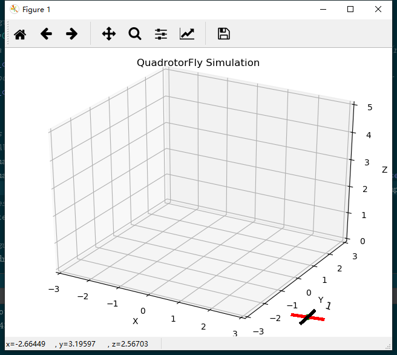
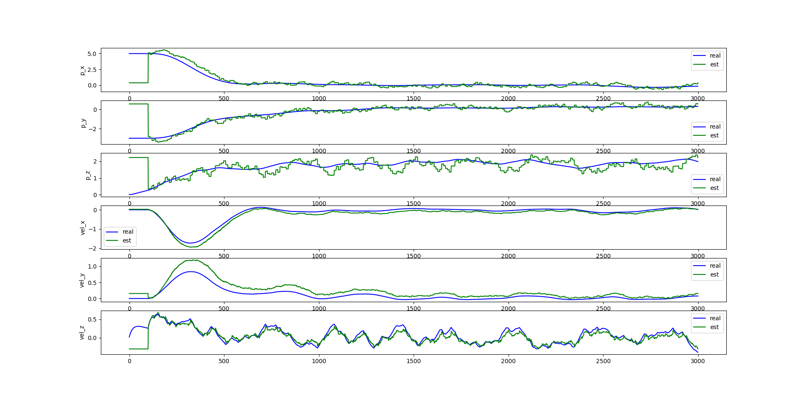
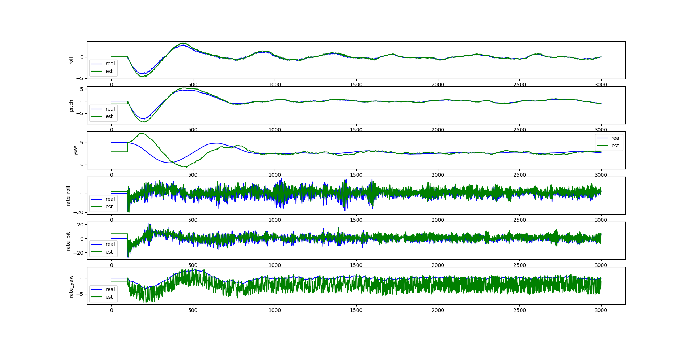

# v0.2 更新的内容

1. 加入了传感器子系统（默认不使能），包含IMU（陀螺仪+加速度计），GPS，compass（磁力计），
1. 加入了一个简单的卡尔曼滤波估计器。
1. 加入了时间系统，即无人机有一个自己的内部时间，每次迭代会累计采样周期，reset回导致时间归零。
2. 参考例子在StateEstimator.py和Test_fullWithSensor.py
3. 可以通过继承SensorBase来完成自定义传感器, 通过继承StateEstimatorBase来实现自定义的位姿估计器

每个传感器考虑不同的特性，主要内容如下：

* IMU考虑噪声和零飘，100Hz的更新频率（与系统默认相同）
* GPS考虑低采样率（10Hz）、噪声、启动延时（1s）和时延（100ms，即latency）
* 磁力计考虑噪声和偏置，坐标系假设为东北天

# 使能传感器系统后的注意事项

下面假设quad1是QuadrotorFlyModel类的一个实例，并且这个类在实例化时使能了传感器系统，即

```python
q1 = Qfm.QuadModel(Qfm.QuadParas(), Qfm.QuadSimOpt(enable_sensor_sys=True))
```

## 及时获取时间戳

不同的传感器采样时刻和启动的时长是不一样的，因此需要启动时要注意延时一定的时间。
使用quad1.ts来获取当前时间戳

## 模型调用接口的返回值发生变化

使能传感器系统后，quad1.step函数和observe函数返回的是传感器信息，传感器信息采用字典类型（dict）储存，格式如下：

```python
print(quad1.observe())
{'imu': (True, array([ 5.78443156e-02, -3.81653176e-01, -9.50556019e+00,  1.75481697e-03,
       -2.82903321e-02,  6.36374403e-02])), 
 'gps': (False, array([ 1.00240709, -0.24003651,  0.64546363])), 
 'compass': (True, array([  7.89924613,  32.83536768, -93.90494583]))}
```

其中，字典的键名是传感器的名称（imu, gps, compass)，值的第一个参数是传感器这一刻是否更新（True代表更新，False反之），第二个值是传感器数据，定义分别如下：

| 名称|imu|gps|compass|
| --------- | -------- | -----: | --: |
|参数1-3|加速度(m/(s^2))|位置(m)|磁场强度(T) |
|参数4-6| 角速度（rad/s)|x|x|

注意，这些传感器的值是带有噪声和零飘的，并且零飘是传感器初始化的时候随机的，
可以通过quad1.imu0.gyroBias和quad1.imu0.accBias获取imu的零飘。假设磁力计的北边和正北大概差16度。

## 真实状态和估计状态存在差异

控制的目的是稳定系统的真实状态，但是只能观测到传感器返回的信息，通过估计器（观测器、滤波器之类的名称）解算得到系统状态与真实的状态会有一定的差异（受估计器性能影响）。但是可以通过quad1.state（这是一个属性化的函数）获得无人机的真实状态，保存数据的时候注意两组数据都需要保存，方便对比。

# 带传感器的完整实验

```python
# 弧度到角度的转换参数
D2R = Qfm.D2R
# 仿真参数设置
simPara = Qfm.QuadSimOpt(
        # 初值重置方式（随机或者固定）；姿态初值参数（随机就是上限，固定就是设定值）；位置初值参数（同上）
        init_mode=Qfm.SimInitType.rand, init_att=np.array([5., 5., 5.]), init_pos=np.array([1., 1., 1.]),
        # 仿真运行的最大位置，最大速度，最大姿态角（角度，不是弧度注意），最大角速度（角度每秒）
        max_position=8, max_velocity=8, max_attitude=180, max_angular=200,
        # 系统噪声，分别在位置环和速度环
        sysnoise_bound_pos=0, sysnoise_bound_att=0,
        #执行器模式，简单模式没有电机动力学，
        actuator_mode=Qfm.ActuatorMode.dynamic
        )
# 无人机参数设置，可以为不同的无人机设置不同的参数
uavPara = Qfm.QuadParas(
        # 重力加速度；采样时间；机型plus或者x
        g=9.8, tim_sample=0.01, structure_type=Qfm.StructureType.quad_plus,
        # 无人机臂长（米）；质量（千克）；飞机绕三个轴的转动惯量（千克·平方米）
        uav_l=0.45, uav_m=1.5, uav_ixx=1.75e-2, uav_iyy=1.75e-2, uav_izz=3.18e-2,
        # 螺旋桨推力系数（牛每平方（弧度每秒）），螺旋桨扭力系数（牛·米每平方（弧度每秒）），旋翼转动惯量，
        rotor_ct=1.11e-5, rotor_cm=1.49e-7, rotor_i=9.9e-5,
        # 电机转速比例参数（度每秒），电机转速偏置参数（度每秒），电机相应时间（秒）
        rotor_cr=646, rotor_wb=166, rotor_t=1.36e-2
        )

# 使用参数新建无人机
quad1 = Qfm.QuadModel(uavPara, simPara)
# 新建卡尔曼滤波器（已实现的，作为参考） 
filter1 = StateEstimator.KalmanFilterSimple()
# 新建GUI
gui = Qfg.QuadrotorFlyGui([quad1])
# 新建存储对象，用于储存过程数据
record = MemoryStore.DataRecord()

# 复位
quad1.reset_states()
record.clear()
filter1.reset(quad1.state)

# 设置imu零飘，这个实际是拿不到的，这里简化了
filter1.gyroBias = quad1.imu0.gyroBias
filter1.accBias = quad1.imu0.accBias
print(filter1.gyroBias, filter1.accBias)

# 设置仿真时间
t = np.arange(0, 30, 0.01)
ii_len = len(t)

# 仿真过程
for ii in range(ii_len):
    # 等待传感器启动
    if ii < 100:
        # 获取传感器数据
        sensor_data1 = quad1.observe()
        # 在传感器启动前使用系统状态直接获取控制器值
        _, oil = quad1.get_controller_pid(quad1.state)
        # 其实只需要油门维持稳定
        action = np.ones(4) * oil
        # 执行一步
        quad1.step(action)
        # 把获取到的传感器数据给估计器
        state_est = filter1.update(sensor_data1, quad1.ts)
        # 储存数据
        record.buffer_append((quad1.state, state_est))
   else:
        # 获取传感器数据
        sensor_data1 = quad1.observe()
        # 使用估计器估计的状态来计算控制量而非真实的状态
        action, oil = quad1.get_controller_pid(filter1.state, np.array([0, 0, 2, 0]))
        # 执行一步
        quad1.step(action)
        # 把获取到的传感器数据给估计器
        state_est = filter1.update(sensor_data1, quad1.ts)
        # 储存数据
        record.buffer_append((quad1.state, state_est))
# 这个不能省去
record.episode_append()

# 输出结果
# 1. 获取最新的数据
data = record.get_episode_buffer()
# 1.1 真实的状态
bs_r = data[0]
# 1.2 估计的状态
bs_e = data[1]
# 2. 产生时间序列
t = range(0, record.count)
# 3. 画图
# 3.1 画姿态和角速度
fig1 = plt.figure(2)
yLabelList = ['roll', 'pitch', 'yaw', 'rate_roll', 'rate_pit', 'rate_yaw']
for ii in range(6):
    plt.subplot(6, 1, ii + 1)
    plt.plot(t, bs_r[:, 6 + ii] / D2R, '-b', label='real')
    plt.plot(t, bs_e[:, 6 + ii] / D2R, '-g', label='est')
    plt.legend()
    plt.ylabel(yLabelList[ii])

# 3.2 画位置和速度
yLabelList = ['p_x', 'p_y', 'p_z', 'vel_x', 'vel_y', 'vel_z']
plt.figure(3)
for ii in range(6):
    plt.subplot(6, 1, ii + 1)
    plt.plot(t, bs_r[:, ii], '-b', label='real')
    plt.plot(t, bs_e[:, ii], '-g', label='est')
    plt.legend()
    plt.ylabel(yLabelList[ii])
plt.show()
print("Simulation finish!")
```

结果

1. 从3d的效果图可以看出有一点抖动
   

2. 位置的真实和估计
   

3. 姿态的真实和估计
   

# 基本原理

## 传感器仿真的原理

### IMU考虑噪声和零飘，100Hz的更新频率（与系统默认相同）

陀螺仪参考的参数来自传感器MPU6500


其中下标带o的是传感器的输出，$\omega$是真实的角速度，$a_F$是真实的合外力造成的加速度，g是重力加速度，$R_{i2b}$是惯性系到机体系的转换矩阵，
$b_g$和$b_a$分别是陀螺仪和加速度计的零飘，$w_g$和$w_a$分别是陀螺仪和加速度计的噪声，这里假设成白噪声。

### GPS考虑低采样率、噪声、启动延时和时延

GPS默认的参数来自M8N，采样率为10H、精度为1米、启动延时为1s，时延（即latency)
是100ms。时延和启动延时是不一样的，时延指由于采样过程或者传输过程导致采集的数据表征的是之前时刻的状态，启动延时就是启动的前1秒内没有响应，之后就有响应。


其中t代表连续的时间，$t_k$是采样的序列，$T_s$和$T_l$分别代表启动延时和时延，$w_p$是传感器噪声。

### 磁力计主要考虑低采样率

与imu类似，采样率只有imu的1/10，假设的惯性坐标系为东北天。

## 最简卡尔曼滤波器的原理

懒，下次再说吧，详细见代码。简单的说就是首先判断各个传感器是否更新，更新的话就运行相应的更新程序。在姿态估计上，陀螺仪当作过程更新，加速度计（就是测重力方向）和磁力计当作测量更新；在位置估计上，加速度计做过程更新，gps做测量更新。